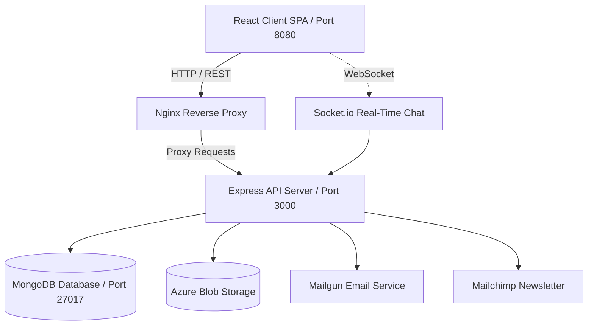

# 🛒 MERN Stack E-Commerce & DevOps Platform

[](https://nodejs.org/)
[](https://reactjs.org/)
[](https://expressjs.com/)
[](https://www.mongodb.com/)
[](https://www.docker.com/)
[](https://nginx.org/)
[](https://azure.microsoft.com/)
[](LICENSE)

A robust, enterprise-grade full-stack e-commerce web application built on the **MERN** (MongoDB, Express, React, Node.js) stack, fully containerized and production-ready using **Docker**, **Nginx**, and modern **DevOps** principles.

---

## 📑 Table of Contents

- [Key Features](#-key-features)
- [Architecture & Tech Stack](#-architecture--tech-stack)
- [Repository Structure](#-repository-structure)
- [Prerequisites](#-prerequisites)
- [Environment Configuration](#-environment-configuration)
- [Quick Start: Docker (Recommended)](#-quick-start-docker-recommended)
- [Manual Local Development](#-manual-local-development)
- [Database Seeding](#-database-seeding)
- [DevOps & Containerization Architecture](#-devops--containerization-architecture)
- [Azure Native Architecture & Deployment](#-azure-native-architecture--deployment)
- [Infrastructure as Code](#-infrastructure-as-code)
- [Security](#-security)
- [Monitoring & Cost Management](#-monitoring--cost-management)
- [API Overview](#-api-overview)
- [NPM Scripts Reference](#-npm-scripts-reference)
- [License](#-license)

---

## ✨ Key Features

### 👤 Authentication & Role-Based Access Control (RBAC)
- **Multi-Role System:** Customer / Member, Merchant, and Administrator roles with protected routes and actions.
- **Authentication Providers:** Email/Password authentication with JWT (JSON Web Tokens) and bcrypt password hashing.
- **Social OAuth 2.0:** Single Sign-On via Google and Facebook (Passport.js).
- **Account Management:** Password reset workflows via secure email tokens, profile updating, and address management.

### 🛍️ Product Catalog & Shopping Experience
- **Catalog Management:** Filter and sort products by category, brand, price range, and customer review ratings.
- **Search & Auto-Suggest:** Instant keyword search with autocomplete and highlighting.
- **Cart & Wishlist:** Real-time cart state management with Redux, tax and shipping calculations, and persistent wishlist.
- **Order Processing:** Checkout pipeline with multi-step order placement, invoice generation, status lifecycle tracking (`Not Processed`, `Processing`, `Shipped`, `Delivered`, `Cancelled`).

### 🏬 Multi-Vendor / Merchant Workflow
- **Merchant Onboarding:** Merchants can apply to sell products directly through the platform.
- **Brand & Inventory Control:** Merchant-level dashboard for inventory tracking and catalog management.

### 💬 Real-Time Communication & Marketing
- **Live Support Chat:** Real-time customer support chat powered by **Socket.io**.
- **Email Marketing:** Newsletter subscriptions integrated with **Mailchimp**.
- **Transactional Emails:** Order confirmations and notifications powered by **Mailgun**.
- **Asset Storage:** Cloud product image uploads handled with **Azure Blob Storage** and Multer.

---

## 🏗 Architecture & Tech Stack



### Frontend
- **Framework:** React.js 16.8 (Hooks & Class components)
- **State Management:** Redux + Redux-Thunk + Connected-React-Router
- **Styling & UI:** Reactstrap (Bootstrap 4), SCSS, FontAwesome
- **Bundler:** Webpack 4 with production minification, asset pipeline, and PWA manifest support

### Backend
- **Runtime:** Node.js (v16 LTS) & Express.js
- **Database:** MongoDB with Mongoose ODM
- **Security:** Helmet, CORS, Data Sanitization (DOMPurify, Validator.js)
- **Authentication:** Passport.js (JWT, Google OAuth 2.0, Facebook)
- **Real-time:** Socket.io

### DevOps & Infrastructure
- **Containerization:** Docker with multi-stage build optimization
- **Web Server & Proxy:** Nginx Alpine with built-in rate limiting (`limit_req_zone`) and SPA route fallback
- **Orchestration:** Docker Compose (multi-service: client, server, mongodb)

---

## 📁 Repository Structure

```text
mern-ecommerce/
├── client/                     # Frontend React SPA
│   ├── app/                    # React components, containers, redux actions/reducers
│   ├── public/                 # Static assets, favicon, index.html template
│   ├── webpack/                # Development & Production Webpack configurations
│   ├── Dockerfile              # Multi-stage production build (Node -> Nginx)
│   ├── nginx.conf              # Nginx server config with rate limiting & SPA routing
│   └── package.json            # Frontend dependencies & build scripts
├── server/                     # Backend Express REST API
│   ├── config/                 # Passport, MongoDB, and environment configuration
│   ├── constants/              # Application enumerations (roles, order statuses)
│   ├── middleware/             # Role verification, JWT authentication middleware
│   ├── models/                 # Mongoose schemas (User, Product, Order, etc.)
│   ├── routes/                 # RESTful API route definitions
│   ├── services/               # Integrations (Azure Storage, Mailgun, Mailchimp)
│   ├── socket/                 # Socket.io chat handlers
│   ├── utils/                  # DB connection & Faker database seed scripts
│   ├── Dockerfile              # Node.js backend container definition
│   └── package.json            # Backend dependencies & scripts
├── docker-compose.yml          # Multi-container orchestration specification
├── package.json                # Root orchestration scripts (dev, install, seed)
└── README.md                   # Project documentation
```

---

## ⚙️ Prerequisites

Before getting started, make sure you have the following installed on your machine:

- [Git](https://git-scm.com/)
- [Node.js](https://nodejs.org/) (v16.x recommended) and `npm` (v7+)
- [Docker](https://www.docker.com/) & [Docker Compose](https://docs.docker.com/compose/) (for containerized setup)
- [MongoDB](https://www.mongodb.com/) (if running locally without Docker)

---

## 🔑 Environment Configuration

### 1. Server Configuration (`server/.env`)

Create a `.env` file in the `server/` directory (refer to `server/.env.example`):

```env
# Application & Database
PORT=3000
BASE_API_URL=api
CLIENT_URL=http://localhost:8080
MONGO_URI=mongodb://127.0.0.1:27017/mern_ecommerce
JWT_SECRET=your_jwt_secret_key_here

# Mailgun (Transactional Emails)
MAILGUN_KEY=your_mailgun_api_key
MAILGUN_DOMAIN=your_mailgun_domain
MAILGUN_EMAIL_SENDER=noreply@yourdomain.com

# Mailchimp (Newsletter)
MAILCHIMP_KEY=your_mailchimp_key
MAILCHIMP_LIST_KEY=your_mailchimp_audience_id

# OAuth Credentials (Optional for local testing)
GOOGLE_CLIENT_ID=your_google_client_id
GOOGLE_CLIENT_SECRET=your_google_client_secret
GOOGLE_CALLBACK_URL=http://localhost:3000/api/auth/google/callback

FACEBOOK_CLIENT_ID=your_facebook_client_id
FACEBOOK_CLIENT_SECRET=your_facebook_client_secret
FACEBOOK_CALLBACK_URL=http://localhost:3000/api/auth/facebook/callback

# Azure Blob Storage (Optional for product image uploads)
AZURE_STORAGE_CONNECTION_STRING=your_azure_storage_connection_string
# Or use Account Name & Key
AZURE_STORAGE_ACCOUNT_NAME=your_storage_account_name
AZURE_STORAGE_ACCOUNT_KEY=your_storage_account_key
AZURE_STORAGE_CONTAINER_NAME=products

# Azure Application Insights (Optional — enables server observability, leave blank to disable)
APPLICATIONINSIGHTS_CONNECTION_STRING=your_application_insights_connection_string
```

### 2. Client Configuration (`client/.env`)

Create a `.env` file in the `client/` directory (refer to `client/.env.example`):

```env
API_URL=http://localhost:3000/api
# Optional: Set custom Socket.io server URL for Azure deployments
SOCKET_URL=http://localhost:3000
```

---

## 🚀 Quick Start: Docker (Recommended)

The easiest way to run the full stack with zero manual dependency headaches is via Docker Compose:

1. **Clone the repository:**
   ```bash
   git clone https://github.com/mohamedsamara/mern-ecommerce.git
   cd mern-ecommerce
   ```

2. **Launch all containers:**
   ```bash
   docker-compose up --build
   ```

   This automatically performs:
   - Starts MongoDB on port `27017`.
   - Builds the Node.js API, seeds the database with an admin user (`admin@example.com` / `admin123`) and 100 mock products, and exposes it on port `3000`.
   - Runs a multi-stage build of the React app and serves it via Nginx on port `8080`.

3. **Access the application:**
   - **Storefront:** [http://localhost:8080](http://localhost:8080)
   - **Backend API:** [http://localhost:3000/api](http://localhost:3000/api)
   - **Admin Credentials:** `admin@example.com` / `admin123`

4. **Stop the containers:**
   ```bash
   docker-compose down
   ```

---

## 💻 Manual Local Development

If you wish to develop without Docker:

### 1. Install Dependencies
Run the root post-install script to install both client and server dependencies:
```bash
npm run postinstall
```

### 2. Start MongoDB
Ensure MongoDB is running locally on port `27017`:
```bash
mongod
```

### 3. Seed Mock Data (Optional but recommended)
Populate your database with an administrator account, categories, brands, and mock products:
```bash
cd server
npm run seed:db admin@example.com admin123
cd ..
```

### 4. Run Development Servers
Start both client and server simultaneously using `npm-run-all`:
```bash
npm run dev
```

Alternatively, run each in separate terminals:
- **Server:**
  ```bash
  cd server
  npm run dev
  ```
- **Client:**
  ```bash
  cd client
  npm run dev
  ```

---

## 🌱 Database Seeding

The database seed utility uses `@faker-js/faker` to generate mock data for fast development and testing.

To run the seed script manually:
```bash
cd server
npm run seed:db <admin-email> <admin-password>
```

**What gets created:**
- 1 Admin account with the credentials passed in.
- 10 Product Categories.
- 10 Brand Entities.
- 100 Products linked with random categories, brands, prices, and SKUs.

---

## 🐳 DevOps & Containerization Architecture

### Multi-Stage Dockerfile (`client/Dockerfile`)
The client uses a multi-stage Docker build to keep the production image lightweight and fast:
1. **Stage 1 (Build):** Compiles the Webpack production bundle in a `node:16.20.2-buster-slim` container.
2. **Stage 2 (Serve):** Copies only the compiled `/dist` directory into an `nginx:alpine` image, dropping all build-time dependencies and node_modules.

### Nginx Hardening & Rate Limiting (`client/nginx.conf`)
- **Rate Limiting:** Protects the frontend from abuse using `limit_req_zone $binary_remote_addr zone=mylimit:10m rate=10r/s;` with a burst allowance of 70.
- **Client Routing:** Uses `try_files $uri /index.html;` to properly support React Router single-page navigation without 404 errors on page refresh.

### Docker Compose Network Topology
All containers (`client`, `server`, `mongo`) communicate through an internal isolated bridge network (`app-network`), ensuring MongoDB is not exposed externally in production settings.

---

## ☁️ Azure Native Architecture & Deployment

### Azure DevOps CI/CD

The repository includes [`azure-pipelines.yml`](azure-pipelines.yml). It runs on pull requests and pushes to `develop` or `master`:

1. Pull requests install dependencies, run the server tests, and build the client.
2. A push to `develop` builds both Docker images, scans them with Trivy, pushes the commit-tagged images to ACR, and deploys to `staging`.
3. A push to `master` builds and scans the images, then deploys them to `production` after the approval check.

Create an Azure DevOps service connection named `ecommerce-azure` and a variable group containing the secret variables `APPLICATIONINSIGHTS_CONNECTION_STRING`, `AKS_KEYVAULT_IDENTITY_CLIENT_ID`, and `AZURE_TENANT_ID`. The pipeline uses the Azure DevOps environments `ecommerce-staging` and `ecommerce-production`; configure a manual approval check on `ecommerce-production` in Azure DevOps before enabling production promotion.

The deployment uses the existing Kubernetes base manifests and applies them into separate namespaces. Staging runs one client and server replica; production runs two replicas. Azure DevOps is the only automated CI/CD platform for this repository.

The backend is built to run as an **Azure-native** application with deep integration into Azure PaaS and Serverless offerings.

### 1. Azure Blob Storage (Media Assets)
Product image uploads use `@azure/storage-blob` instead of third-party cloud SDKs:
- **Authentication:** Supports standard connection strings (`AZURE_STORAGE_CONNECTION_STRING`) or Managed Identity / Account Key credentials (`AZURE_STORAGE_ACCOUNT_NAME` & `AZURE_STORAGE_ACCOUNT_KEY`).
- **Container Management:** Automatically provisions the designated blob container (defaults to `products`) with public blob read access (`access: 'blob'`) to enable direct browser loading of uploaded assets.
- **Graceful Fallback:** If Azure credentials are not provided during local development, the application issues a diagnostic warning and proceeds without breaking.

### 2. Azure App Service / Azure Container Apps
The backend is container-ready for Azure PaaS hosting:
- **Automatic Port Binding:** Dynamic port assignment via `process.env.PORT` ensures seamless compatibility with Azure App Service (which maps incoming traffic via internal ports) and Azure Container Apps.
- **Health Check Integration:** Built-in `/health` and `/api/health` probes supply status and uptime JSON for Azure Liveness and Readiness probes.
- **WebSockets / Socket.io:** Azure App Service WebSockets can be enabled under **Configuration > General settings > Web sockets: On**.

### 3. Database: Azure Cosmos DB (MongoDB API)
The database layer uses standard Mongoose connection strings, allowing drop-in connection to **Azure Cosmos DB for MongoDB** with zero code changes:
```env
MONGO_URI=mongodb://<cosmos-account>:<key>@<cosmos-account>.mongo.cosmos.azure.com:10255/mern_ecommerce?ssl=true&replicaSet=globaldb&retrywrites=false&maxIdleTimeMS=120000&appName=@<cosmos-account>@
```

### 4. Client Wiring for Azure
For the AKS deployment, the client image uses relative `/api` and `/` Socket.io URLs. Nginx proxies those paths to the internal `server:3000` Kubernetes service, so the backend does not need a public endpoint. When hosting the client outside AKS, set `API_URL` and `SOCKET_URL` to the public backend URL instead.

---

## 🧱 Infrastructure as Code

Everything in `infra/` is Terraform (`azurerm` provider). Running `terraform apply` provisions:

| File | Resources |
|---|---|
| `infra/main.tf` | ACR, VNet + subnet, NSG, the AKS cluster itself, and the AcrPull role assignment so AKS can pull images without imagePullSecrets |
| `infra/security.tf` | Key Vault, the `JWT_SECRET` secret, and access policies for both the person running Terraform and AKS's Secrets Store CSI identity |
| `infra/monitoring.tf` | Log Analytics workspace, Application Insights, an action group, and two metric alerts |
| `infra/cost-management.tf` | A resource-group budget with spend notifications |

**ACR note:** the registry used to only be referenced as a `data` source (created manually via `az acr create` before this Terraform existed). It's now a real managed `resource`, which means an existing registry has to be imported into state once before the first `apply` — the exact `terraform import` command is in a comment above the resource in `main.tf`. Skipping that step will make Terraform try to create a second registry with the same name and fail.

**Kubernetes networking note:** only the client Service is public (`LoadBalancer`). The server and MongoDB use internal `ClusterIP` Services. Nginx forwards `/api` and `/socket.io` traffic from the client to `server:3000`. The NSG remains attached to the AKS subnet for the infrastructure requirement; AKS-managed load-balancer rules should be checked after provisioning when custom subnet rules are used.

State is local (no remote backend configured) — fine for a single-contributor capstone, but `**/.terraform/*` and `*.tfstate*` are gitignored either way so no secrets or state end up in the repo.

---

## 🔒 Security

- **Key Vault** (`infra/security.tf`) — `JWT_SECRET` lives in Azure Key Vault, not Azure DevOps variables -> Kubernetes directly. The AKS cluster has the Secrets Store CSI driver add-on enabled (`key_vault_secrets_provider` in `infra/main.tf`), and `kubernetes/secret-provider.yaml` mounts the Key Vault secret into the `server` pod, syncing it into a native `server-secrets` Kubernetes Secret that the container reads via `JWT_SECRET`. App Insights uses a separate `appinsights-secrets` Kubernetes Secret populated by Azure DevOps.
- **Image scanning** — Trivy scans both images in CI (`azure-pipelines.yml`) for CRITICAL vulnerabilities and **fails the build** if any are found (`exit-code: '1'`). HIGH-severity findings are left as informational for now rather than blocking, since gating on those too would need a proper triage/allowlist process this project doesn't have yet.
- **Kubernetes RBAC** (`kubernetes/rbac.yaml`) — the server pod runs under its own `server-sa` ServiceAccount with a minimal Role, instead of the namespace's default ServiceAccount (which can often read Secrets/ConfigMaps in some cluster configs). It's scoped to `get`/`list` on ConfigMaps only — the app doesn't talk to the Kubernetes API today, so this is intentionally close to zero permissions rather than guessing at future needs.
- **NetworkPolicy** (`kubernetes/network-policy.yaml`) — `mongo` only accepts traffic from the `server` pod on port 27017. The client is the only public Kubernetes Service; the server and MongoDB remain internal.

**Deploying this**: `terraform apply` needs `TF_VAR_jwt_secret` set (no default is checked in). After applying, add `AKS_KEYVAULT_IDENTITY_CLIENT_ID`, `AZURE_TENANT_ID`, and `APPLICATIONINSIGHTS_CONNECTION_STRING` as secret variables in the `ecommerce-secrets` Azure DevOps variable group. The values come from `terraform output aks_keyvault_identity_client_id`, your tenant ID, and the Application Insights output; the pipeline patches `secret-provider.yaml` with the cluster identity before deploying.

---

## 📈 Monitoring & Cost Management

Set up through Terraform ([`infra/monitoring.tf`](infra/monitoring.tf), [`infra/cost-management.tf`](infra/cost-management.tf)) instead of clicking through the portal.

### Monitoring
- **Log Analytics Workspace** (`azurerm_log_analytics_workspace.main`) — central sink for cluster and application telemetry, 30-day retention by default.
- **AKS Container Insights** — enabled via the `oms_agent` block on the AKS cluster resource; ships node/pod/container CPU, memory, and log data to the workspace, visible under the cluster's *Insights* blade.
- **Application Insights** (`azurerm_application_insights.server`) — workspace-based, tracks the Node/Express API's requests, dependencies, exceptions, and live metrics. The server auto-instruments via `server/config/monitoring.js`, activated by setting `APPLICATIONINSIGHTS_CONNECTION_STRING` (wired through the `appinsights-secrets` Kubernetes Secret in CI/CD — see [`azure-pipelines.yml`](azure-pipelines.yml)); it's a no-op when unset, so local dev is unaffected.
- **Alerts** — two `azurerm_monitor_metric_alert` rules (server high-latency, AKS node high-CPU) notify `azurerm_monitor_action_group.ops` by email when triggered.

### Cost Management
- **Budget** (`azurerm_consumption_budget_resource_group.monthly`) — scoped to the resource group, with notifications at 80% actual, 100% actual, and 100% forecasted spend.
- **Cost estimate** — a full Azure Pricing Calculator-based breakdown, itemized per service (AKS, ACR, Load Balancer, Log Analytics, Application Insights), is documented in [`docs/cost-estimate.md`](docs/cost-estimate.md).

Configure the alert email and budget amount via `alert_email` and `monthly_budget_inr` in `infra/variables.tf`.

---

## 🔌 API Overview

All API endpoints are prefixed by `/api`:

| Method | Endpoint | Description | Access |
| :--- | :--- | :--- | :--- |
| `GET` | `/health` | Cloud health probe / service uptime | Public |
| `GET` | `/api/health` | API health probe / service uptime | Public |
| `POST` | `/api/auth/register` | Register new user | Public |
| `POST` | `/api/auth/login` | Login user & return JWT | Public |
| `GET` | `/api/auth/google` | Google OAuth authentication | Public |
| `GET` | `/api/auth/facebook` | Facebook OAuth authentication | Public |
| `GET` | `/api/product` | List active products (paginated, filtered) | Public |
| `GET` | `/api/product/item/:slug` | Retrieve single product by slug | Public |
| `POST` | `/api/product/add` | Create new product | Merchant / Admin |
| `PUT` | `/api/product/:id` | Update product details | Merchant / Admin |
| `GET` | `/api/category/list` | List all product categories | Public |
| `GET` | `/api/brand/list` | List all brands | Public |
| `POST` | `/api/cart/add` | Add items to cart | Authenticated |
| `POST` | `/api/order/add` | Place a new order | Authenticated |
| `GET` | `/api/order/me` | Fetch user order history | Authenticated |
| `POST` | `/api/merchant/add` | Submit merchant application | Authenticated |
| `POST` | `/api/contact/add` | Submit contact form message | Public |
| `POST` | `/api/newsletter/subscribe`| Subscribe email to newsletter | Public |

---

## 📜 NPM Scripts Reference

### Root Directory
- `npm run dev`: Runs both client and server development servers in parallel.
- `npm run dev:client`: Runs client webpack-dev-server (`localhost:8080`).
- `npm run dev:server`: Runs backend server with nodemon (`localhost:3000`).
- `npm run postinstall`: Installs dependencies across both root, server, and client.

### Server (`server/`)
- `npm run dev`: Starts server with `nodemon` for auto-reloading.
- `npm start`: Starts server in production mode with `cross-env NODE_ENV=production`.
- `npm run seed:db <email> <password>`: Seeds MongoDB with an admin account, categories, brands, and 100 products.

### Client (`client/`)
- `npm run dev`: Starts client with `webpack-dev-server`.
- `npm run build`: Cleans `dist` and builds production bundle using Webpack.
- `npm run clean`: Removes existing `dist/` build directory.

---

## 📄 License

This project is licensed under the [MIT License](LICENSE).
